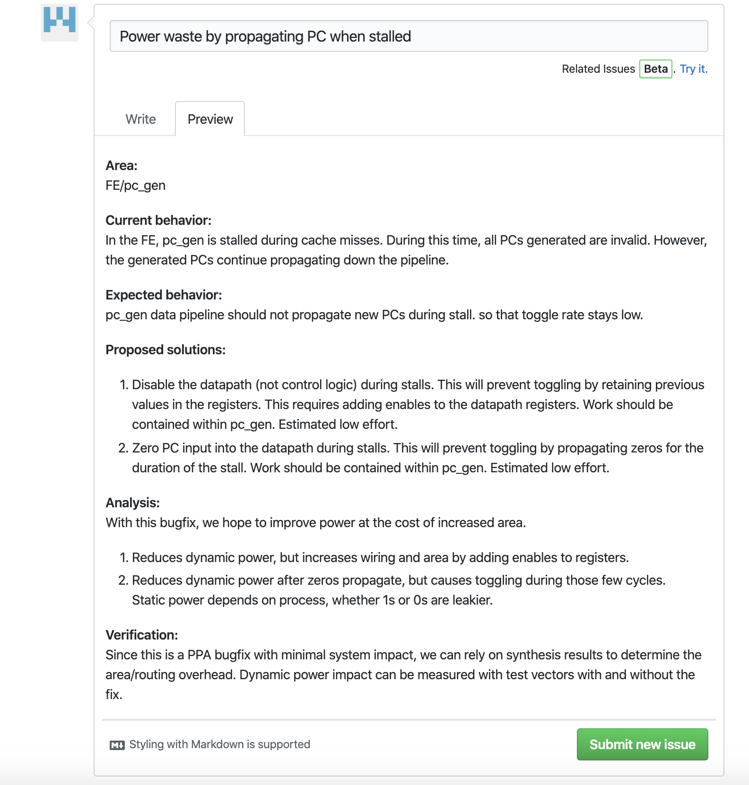

# How to Contribute
## Creating an issue

Raising an issue is the easiest and most effective way to begin engaging with BlackParrot (or any open-source project).  Being thorough and detailed in the issue makes it easier to communicate, requiring fewer roundtrip messages (increasing time to resolution).

Generally, there are three types of issues raised in BlackParrot.

### Bug reports
**Something doesn't look right to me.**
- Suggested fields:
    - Descriptive title.
    - Module/tool/makefile/script in question.
    - Current behavior (steps for reproduction).
    - Expected behavior.
    - Proposed solution(s), including scope of work and affected modules.
    - Analysis of potential impact.
    - Methods of verification.
- Resolution: Bug fixed, analysis shows not a true bug.

### Feature requests
**I would like BlackParrot to do this.**
- Suggested fields:
    - Descriptive title.
    - Module/tool/makefile/script in question.
    - Current behavior.
    - Desired behavior / rationale for change.
    - Proposed solution(s), including scope of work and affected modules.
    - Analysis of potential impact.
    - Methods of quantitative evaluation.
- Resolution: Feature added, feature deferred, feature discouraged.

### Informational
**I don't understand this.**
- Suggested fields:
    - Descriptive title.
    - Module/tool/makefile/script in question.
    - Background information already gathered.
    - Information requested.
- Resolution: Additional comments, additional documentation.

## Making a PR
The absolute most important factor in making a successful open-source contribution is communication with the maintainers. Therefore it is highly recommended to raise an issue and discuss potential implementation paths before making a pull request. "Dumping code" is discouraged. 

An ideal collaboration looks like the following:
1. I would like BlackParrot to be able to eat ants.
2. Open an issue
    - Title: "Support for eating ants"
    - Supporting eating ants would increase PPA because BlackParrot would have more energy.
    - We could either modify the beak or the talons, with the tradeoff being that the beak is more efficent, but harder to modify.
3. Communicate with BlackParrot maintainers
    - We have an extensive talon modification pending on another branch, which will be incompatible with your talon proposal. Your beak proposal is interesting though, have you considered the effects on eating berries?
    - \<Back and forth\>
    - Design specification document is written and agreed upon.
4. Make a PR with an initial version of code.
5. Iterate with BlackParrot maintainers on code quality, required testing, PPA analysis, etc.
6. PR is merged! (°<°)

## Tips for having your PR approved
- Follow the [BlackParrot style guide](STYLE_GUIDE.md).
- Make separate commits for moving files, cleaning files and functional changes.
- Rebase away 'temporary' or 'broken' commits.
- Code should lint in both Verilator and VCS (if you have access to it).
- Don't commit intermediate or generated files.

## Permanent branches
- master: release branch
    - Clients should be able to git clone and run a working copy at all times.
    - Functionality, power, performance CI MUST pass before merge is accepted
- dev: development branch  
    - Developers should be able to git clone and run a buggy copy at all times.
    - CI should pass before merge is accepted.  
    - Occasional churn at this level is acceptable as there may be inter-module dependencies being worked on.
- top_dev: bp_top development branch
    - Top level wrapping modules; tiles, off-chip networks, SoC configurations.
    - CI should often pass, but there is no gatekeeper at this level.  
- fe_dev, be_dev, me_dev: Module level development branch
    - All \<end\> work should branch off of and merge into these branches. These will periodically merge from and into dev.
    - CI should often pass, but there is no gatekeeper at this level.  
- sw_dev: Software development branch
    - All CAD flow, software tests and debugging utilities should branch off and merge into this branch. sw_dev will periodically merge from and into dev.
    - CI should often pass, but there is no gatekeeper at this level

## Temporary branches (or external PRs)
All other branches should branch off of their most related \<end\>\_dev branch and named \<end>\_dev\_\<scope\>_\<change_name\>. The name should match exactly, as CI uses regexes to track branch lifetimes and merge policies. 

Each scope has an affilated half-life.  By the end of its half-life, the branch should be merged back into a permanent branch or rebased onto its parent branch. If another half-life passes without an update on the branch, it will be committed to a tag and the branch will be deleted.

### Available scopes
- hotfix: Urgent, extremely minor fixes
    - Should only exist for duration of PR
    - Examples: documentation fies, changing flags for regression, updating submodules
    - Hotfixes are the only non-mainline PRs allowed into dev or master. i.e. master_feature_foobar is an illegal branch
- fix: Minor fixes
    - 1-2 days
    - Example: Sending unnecessary stalls, update hazard detection
    - Fixes are allowable into dev, but not master.
- feature: Medium sized enhancement
    - 1 week
    - Example: Adding new branch predictor
- project: Large enhancement with significant system impact
    - 2 weeks
    - Example: Adding a scratchpad to the D$

Larger modifications should be broken into multiple, smaller targets. Else, it risks becoming stale and never able to merge.

For instance, a new branch predictor should be worked on in a branch fe_dev_feature_tournamentbranchpredictor, branched from fe_dev and merged back into fe_dev within 2 weeks

## Tags
There are three kinds of tags in BlackParrot: release tags, cryo tags and archive tags. These correspond to branches which do not have active development, but have historical value

### Release tag
When a version of BlackParrot is deemed significant, for example a tapeout version, a release tag should be created with the name release/\<scope\>\_\<change name\>.  A README_tag.md must be placed in the root directory briefly describing the state of the release.

### Archive tag
When a temporary branch reaches end of life and is determined by maintainers as unlikely to ever merge into a permanent branch, an archive tag should be created with the name archive/\<scope\>\_\<change name\>. A README_tag.md must be placed in the root directory briefly describing the overall goals of the temporary branch, as well as reasons why it failed to be merged.

### Cryo tag
When a temporary branch reaches end of life and is determined by maintainers as not yet of sufficient quality to merge, but which may have value in the future with additional work, a cryo tag should be created with the name cyro/\<scope\>_\<change_name\>.  A README_tag.md must be placed in the root directory briefly describing the overall goals, challenges encountered and additional work required before mainline acceptance.
