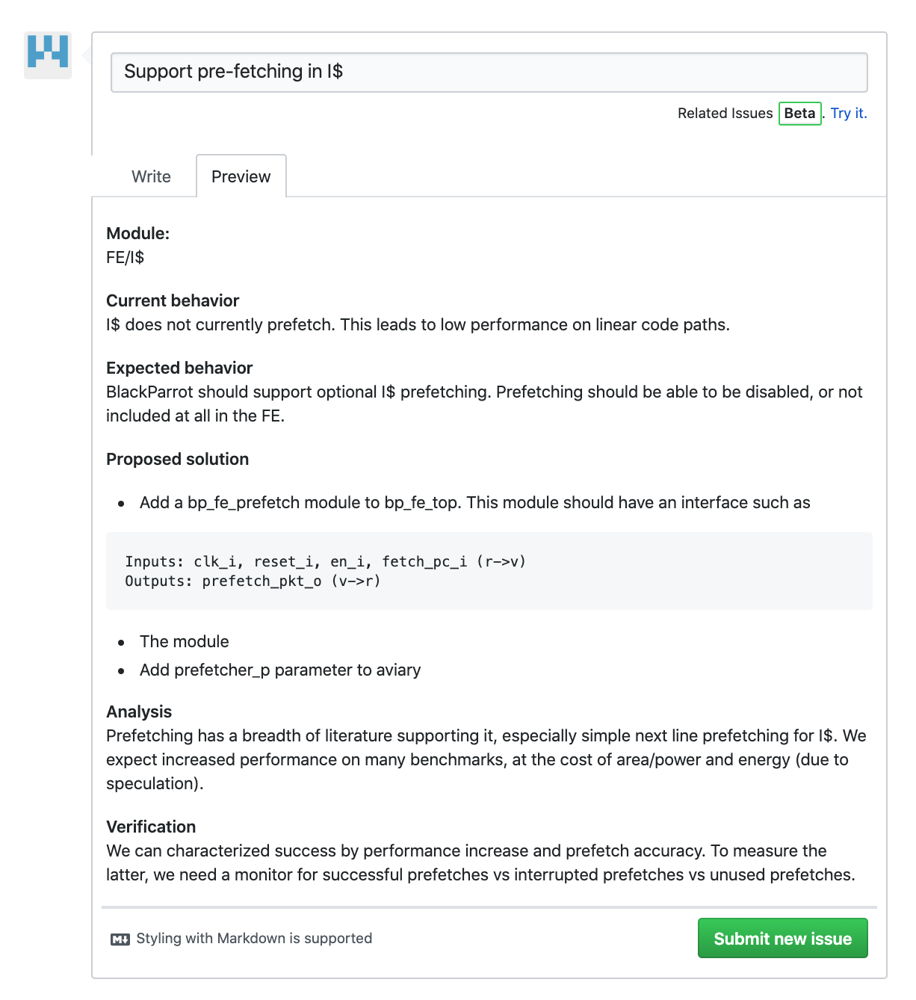
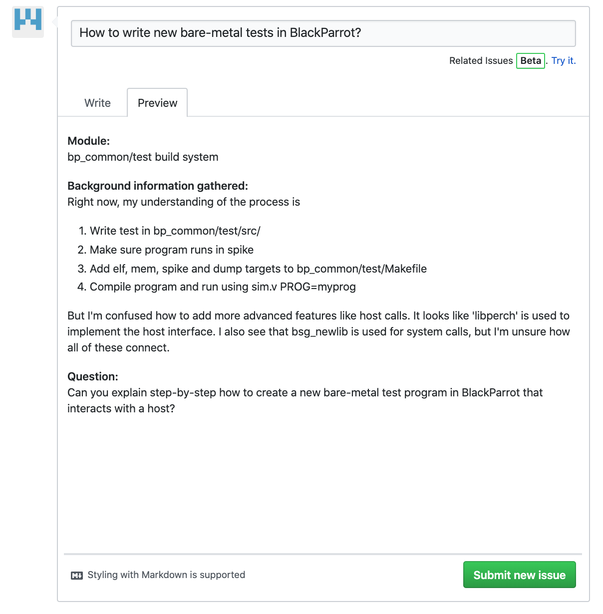

# How to Contribute
## Repository overview

- **bp_fe/** contains the front-end (FE) of BlackParrot, responsible for speculative fetching of instructions.
- **bp_be/** contains the back-end (BE) of BlackParrot, responsible for atomically executing instructions, as well as logically controlling the FE.
- **bp_me/** contains the memory-end (ME) of BlackParrot, responsible for servicing memory/IO requests as well as maintaining cache coherence between BlackParrot cores.
- **bp_top/** contains configurations of FE, BE, and ME components. For instance, tile components and NOC assemblies.
- **bp_common/** contains the interface components which connect FE, BE and ME. FE, BE, ME may depend on bp\_common, but not each other.
- **ci/** contains scripts used to run Continuous Integration jobs, mostly using the same Makefile commands but with additional data collection.
- **docs/** contains documentation, images, guides and links to document Blackparrot.
- **external/** contains third-party dependencies

## Creating an issue

Raising an issue is the easiest and most effective way to begin engaging with BlackParrot (or any open-source project).
Being thorough and detailed in the issue makes it easier to communicate, requiring fewer roundtrip messages (increasing time to resolution).

Generally, there are three types of issues raised in BlackParrot.

### Bug reports

**Something doesn't look right to me.**
- Suggested fields:
    - Descriptive title.
    - Module/tool/makefile/script in question.
    - Current behavior (steps for reproduction).
    - Expected behavior.
    - Proposed solution(s), including scope of work and affected modules.
    - Analysis of potential impact.
    - Methods of verification.
- Resolution: Bug fixed, analysis shows not a true bug.

### Feature requests

**I would like BlackParrot to do this.**
- Suggested fields:
    - Descriptive title.
    - Module/tool/makefile/script in question.
    - Current behavior.
    - Desired behavior / rationale for change.
    - Proposed solution(s), including scope of work and affected modules.
    - Analysis of potential impact.
    - Methods of quantitative evaluation.
- Resolution: Feature added, feature deferred, feature discouraged.

### Informational

**I don't understand this.**
- Suggested fields:
    - Descriptive title.
    - Module/tool/makefile/script in question.
    - Background information already gathered.
    - Information requested.
- Resolution: Additional comments, additional documentation.

## Making a PR

The absolute most important factor in making a successful open-source contribution is communication with the maintainers.
Therefore it is highly recommended to raise an issue and discuss potential implementation paths before making a pull request.
"Dumping code" is discouraged.

An ideal collaboration looks like the following:
1. I would like BlackParrot to be able to eat ants.
2. Open an issue
    - Title: "Support for eating ants"
    - Supporting eating ants would increase PPA because BlackParrot would have more energy.
    - We could either modify the beak or the talons, with the tradeoff being that the beak is more efficent, but harder to modify.
3. Communicate with BlackParrot maintainers
    - We have an extensive talon modification pending on another branch, which will be incompatible with your talon proposal. Your beak proposal is interesting though, have you considered the effects on eating berries?
    - \<Back and forth\>
    - Design specification document is written and agreed upon.
4. Make a PR with an initial version of code.
5. Iterate with BlackParrot maintainers on code quality, required testing, PPA analysis, etc.
6. PR is merged! (°<°)

## Tips for having your PR approved

- Follow the [BlackParrot style guide](STYLE_GUIDE.md).
- Make separate commits for moving files, cleaning files and functional changes.
- Rebase away 'temporary' or 'broken' commits.
- Code should lint in both Verilator and VCS (if you have access to it).
- Don't commit intermediate or generated files.

## Stable branches

- master: release branch
    - Clients should be able to git clone and run a working copy at all times.
    - Functionality, power, performance CI MUST pass before merge is accepted
- dev: development branch
    - Developers should be able to git clone and run a buggy copy at all times.
    - CI should pass before merge is accepted.
    - Occasional churn at this level is acceptable as there may be inter-module dependencies being worked on.
- other branches: feature or debug branches
    - do not rely on these, but maintainers may push fixes here for triage

## Tags
There are three kinds of tags in BlackParrot: release tags, cryo tags and archive tags.
These correspond to branches which do not have active development, but have historical value.

### Release tag
When a version of BlackParrot is deemed significant, for example a tapeout version, a release tag should be created with the name release/\<scope\>\_\<change name\>.
A README\_tag.md must be placed in the root directory briefly describing the state of the release.

### Archive tag
When a temporary branch reaches end of life and is determined by maintainers as unlikely to ever merge into a permanent branch, an archive tag should be created with the name archive/\<scope\>\_\<change name\>.
A README\_tag.md must be placed in the root directory briefly describing the overall goals of the temporary branch, as well as reasons why it failed to be merged.

### Cryo tag
When a temporary branch reaches end of life and is determined by maintainers as not yet of sufficient quality to merge, but which may have value in the future with additional work, a cryo tag should be created with the name cyro/\<scope\>\_\<change name\>.
A README\_tag.md must be placed in the root directory briefly describing the overall goals, challenges encountered and additional work required before mainline acceptance.

## Code aesthetics

BlackParrot is written in standard SystemVerilog, using a subset of the language known to be both synthesizable and compatible with a wide variety of vendor tools.
These guidelines are intended to provide more rigidity for coding style and file structure to ease friction during diffs and automated text processing.
These guidelines are in addition to the [BSG SystemVerilog Coding Guidelines](https://docs.google.com/document/d/1xA5XUzBtz_D6aSyIBQUwFk_kSUdckrfxa2uzGjMgmCU), augmenting with stricter conventions and aesthetic guidelines.
 
### References

[BSG SystemVerilog Coding Guidelines](https://docs.google.com/document/d/1xA5XUzBtz_D6aSyIBQUwFk_kSUdckrfxa2uzGjMgmCU)

[Freescale Verilog Guidelines](https://michaeltaylor.org/edu/papers/FreescaleVerilog.pdf)

[Google C++ Style Guide](https://google.github.io/styleguide/cppguide.html)

[lowRISCV Verilog Coding Style Guide](https://github.com/lowRISC/style-guides/blob/master/VerilogCodingStyle.md)

### Verilog Style

- No tabs in files, anywhere.  People get different results based on their editor.
    - Exception: Makefiles. Tabs should be used to indent recipes, but not for general alignment
- Align all things that have parallel structure (begin/end, case/endcase, commas, periods, etc.). This makes it easier to check the code and find the matching component.

        if (x_p)  // notice how matching inputs are aligned
          begin: foo
            adder     (this_input, that_input, another_input);
          end
        else
          begin: bar
            wow_adder (this_input,          3, another_input);
          end

        if (foo)    // notice alignment of if/else, begin/end
            x = 3;  // and optional alignment of x = statement.
        else
          begin
            x = 1;
            y = 0;
          end

- Use localparam keyword for derived parameters and input parameters that should not be set by the party instantiating the module.
- Localparams in port lists are allowed, but only for sizing ports. Other generated localparams should go near their consumers.
- Ports and parameters should not have the module name as a prefix, since that is redundant. In some cases, the wires in the parent module may use the module name of the child to disambiguate.

        module foo
          #(parameter bar_p = "inv")
           (input [bar_p-1:0] baz_i  // not foo_baz_i
            );

        foo
         #(.bar_p(foo_bar_p))
         inst
          (.baz_i(foo_baz_li));
- Signals corresponding to a pipeline stage in a module which has multiple stages should have a pipeline stage suffix
    - foobar\_ex1\_lo
    - barbaz\_tv\_n
- ‘0’, ‘1’, ‘2’, ‘3' (when used as byte shift) or '8’ (when used as byte width) are the only allowable magic numbers. Else, consider strongly the use of a localparam.
- Modules and packages are named *.sv, headers are named *.svh
- Import packages within modules (not other headers) to avoid global ($root) package imports
- All defines should ultimately be included by including <end>_defines.svh. Suitably large and related groups of defines should be sub-included within those files.
- All parameters and typedefs should ultimately be compiled with <end>_pkg.sv. Suitably large and related groups of parameters and typedefs should be included within a _pkgdef.svh file, which is not intended to be compiled directly, but instead as part of a larger package.

        foo_pkg.sv:

        package foo_pkg;

        `include "bar_pkgdef.svh"

        endpackage;

        bar_pkgdef.svh:

            `ifndef BAR_PKGDEF_SVH
            `define BAR_PKGDEF_SVH
            localparam bar_width_gp = 42;
            `endif

        foo.v:

        module foo
         import foo_pkg::*;
         #(parameter a = "inv")

### Syntactic style

- snake\_case for all identifiers.
- No capital letters in the source code except in comments or in strings.
- 2 spaces per indent.
- Code inside of a module should be idented once.
- Newline at end of file (helps some old unix tools).
- No whitespace at ends of lines

- Space between type and width e.g. logic [1:0], not logic[1:0].

- Space between keywords and operators.

    begin : // this
    if (x)  // this
    begin:  // not this
    if(x)  // not this

- Per BSG SystemVerilog Style Guide, all generate blocks should be labeled.
- Lines should not exceed 100 (soft limit) or 120 (hard limit) columns.
    - Exception: macro definition parameter lists and usage must be one line to satisfy some tools. Macro bodies should be broken up with backslashification.
    - When breaking lines start the newline with the operator or the first operand.

            foo = super_long_name_that_wraps
                  + other_name;
            foo =
              super_long_name_that_wraps + other_name;

- Lists should be formatted in one of the following ways:

        (all, one, line)

        (all
         ,one
         ,line
         )

        (spaces, after, commas, horizontally)
        (but
         ,not
         ,vertically
         )

        // Except for between commas and keywords
        , parameter p
        ...
        , input  i
        , output o
        )

- Declarations and instantations should be formatted in one of the following ways:
        // Module declaration
        module foo
         #(parameter width\_p    = “inv” // note alignment
           , parameter height\_p = “inv” // space between , and parameter
           )
          (input [width\_p-1:0]    bar\_i // port names aligned
           , input [height\_p-1:0] baz\_i // space between , and input
           );

        // Module instantiation
        foo
         #(.width_p(3)   // # indented by 1 space
           ,.height_p(5) // no space between , and .
           )
         inst                   // inst name aligned with #
          (.bar_i(foo_bar_li)   // parentheses of parameters and ports aligned
           ,.baz_i(foo_baz_li)
           );

        // Can combine parameter or port lists to one line
        foo
         #(.width_p(3) ,.height_p(5))
         inst
          (.bar_i(foo_bar_li), .baz_i(foo_baz_li));

        // Struct declaration
        typedef struct
        {
          logic [1:0] bar; // fields aligned
          logic       baz;
          foobar_s    boo;
        }  foo_s;      // Two spaces to break up struct name from field declarations

        // Enum declaration
        typedef enum
        {
          e_zop  = 2’b00  // All values assigned, rather than default
          ,e_bar = 2’b01  // Values aligned
          ,e_baz = 2’b10
        } foo_e;

- Do not begin comments with // Verilator.  Verilator transforms all comments to /**/ style, which can cause Verilator to interpret an innocuous comment as an invalid pragma. For example, the following example will fail to compile in Verilator!

        module foo
        input logic a;
        output logic b;

        // Verilator cannot handle this construct
        `ifndef VERILATOR
          syntax error
        `endif

        endmodule

