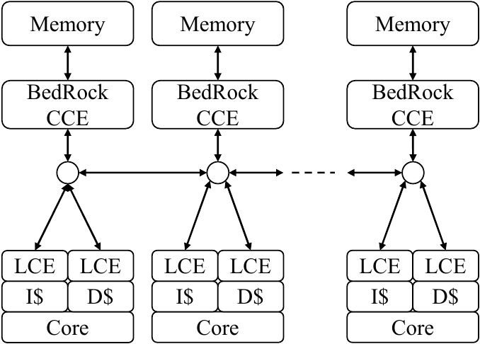

# The BedRock Coherence System

BedRock is the cache coherence system in the BlackParrot system. BedRock ensures that every core's
data and instruction caches are kept coherent to ensure correctness of multicore shared-memory
operation. BedRock also supports the integration of cache coherent accelerators.

BedRock comprises three major components: a Cache Coherence Engine (CCE) that contains and
manages the coherence directory, a Local Cache Engine (LCE) that manages entities such as data
and instruction caches participating in coherence, and the coherence networks that carry the
protocol messages. BedRock currently has two CCE implementations, which are described below.

A typcial system has many LCEs and one or more CCEs. In BlackParrot, each
standard tile contains a BlackParrot core, data cache and LCE, instruction cache and LCE, and
a CCE. Multiple CCEs manage independent subsets of the physical address space, with the mapping
being consistent throughout the system, and therefore each CCE operates completely independently
from all other CCEs. The current mapping from address to CCE stripes cache blocks across the CCEs
in the system. All cache blocks that map to the same cache set will map to the same
CCE.

The current implementation of BlackParrot uses point-to-point ordered networks for the
coherence networks, however the coherence protocol is designed and verified correct
for unordered or ordered networks.

## Networks

BedRock sends and receives messages on three networks, called Request, Command, and Response.
The messages carried on the BedRock networks are fully defined in the
[ME Interface](../bp_common/src/include/bp_common_me_if.vh) file of the BlackParrot repository.
The [BlackParrot Interface Specification](interface_specification.md) contains a more detailed
overview of the messages carried by the BedRock coherence networks, which are briefly overviewed
here.

The Request network carries coherence requests from the cache controllers (LCE) to the directory
(CCE). A request may be a Read or Write request.

The Command network carries coherence commands to the cache controllers (LCE). Most commands are
issued by the directory (CCE), except for cache to cache transfers that occur when a CCE commands
an LCE to send a cache block to another LCE.

The Response network carries coherence responses from the cache controllers (LCE) to the coherence
directory (CCE). Common responses include cache block data writebacks, invalidation acknowledgements,
and coherence transaction acknowledgements.

### Network Priorities

The three coherence networks are related by a priority ordering scheme. The Response network is the
highest priority, followed by the Command network, and lastly the Request network with the lowest
priority. Processing a message on a lower priority network may cause a message to be sent on a
higher priority network, but not the other way around. For example, a Request message can cause
a Command message to be sent, or a Command message can cause a Response message to be sent, but
a Response message can not cause any message to be sent since it is the highest priority network.
It is also possible for a Command network message to cause a single extra message to be sent on the
Command network, when performing a cache to cache data transfer. Preserving the priority ordering
of the networks helps prevent deadlock-free protocol operation and prevent the presence of
message cycles across the three networks.

## Protocol

The BedRock cache coherence protocol supports the MOESIF family of protocols using a directory-based
coherence system. The coherence directory, managed by the CCE, is effectively a duplicate tags or
shadow tags directory design. The key difference between BedRock and a canonical shadow tags
directory is that in BedRock it is the directory (CCE), not the local caches (LCE), that maintains
and manages the golden copy of the tags. The local caches (LCEs) hold shadow tags and are only
allowed to modify their coherence state when instructed to do so by the directory (CCE). The
directory full controls all coherence state changes and cache block replacements in all of the
LCEs. This design decision eliminates a number of races from the coherence protocol, greatly
simplifying the implementation of the LCEs and CCE. Cache requests for the same block from
different LCEs may race to the directory, but are serialized by the network and are processed
in the order they arrive by the CCE. No other races exist in the protocol due to the CCE fully
controlling all coherence state changes and cache block replacements.

At the LCE, every cache block has a small amount of associated metadata comprising the coherence
state of the block and a dirty bit. The LCE or cache also tracks, per cache set, any replacement
information required to implement the desired replacement algorithm (e.g., LRU way tracking). The
collection of cache tag, coherence state, and dirty bit for each block in a cache set plus the
LRU/replacement information per cache set is called a Tag Set.

The coherence directory collects one or more tag sets into a Way Group. A Way Group adds a pending
bit to the collection of Tag Set information. The pending bit is used to effectively lock the Tag
Sets of the Way Group, allowing only a single coherence transaction per Way Group at a time. The
mapping from address to Tag Set and Way Group is such that all addresses (cache blocks) that map
to the same Tag Set (i.e., cache set in normal cache indexing and lookup) map to the same
Way Group.

### Request Processing

Each request is processed by a single CCE, and requests are processed in the order they arrive at
the CCE. When a new request arrives, the CCE performs a sequence of operations including checking
the associated pending bit, reading the coherence directory, invalidating or downgrading other LCEs
if required, and sourcing the cache block from memory/LLC or another LCE. A cache request may also
trigger a replacement in the requesting LCE if the target cache set has no free entries to fill
the request to.

In order to preserve correctness of the coherence protocol, the CCE must perform certain operations
before others. Primarily, this includes checking the pending bit first, performing replacement
in the requesting LCE if required to make room for the request fill, and then invalidating any
copy of the block from other LCEs prior to granting permissions to the requesting LCE.

At a high level, a coherence request is processed as described by the following list of steps. Each step
may include multiple substeps, and it may be possible to overlap actions of certain steps. The
amount of concurrency between independent requests is dependent on the complexity of the CCE
implementation. In the simplest form, all requests to a single CCE are processed in the order
received. In a complex implementation, it is only necessary to serialize requests to each way group,
while requests to independent way groups may be processed concurrently.

1. Check Pending Bit for way group associated with request address. If the bit is cleared,
   the request can be processed, otherwise stall this request.

2. Read coherence directory to determine which LCEs have block cached and in which states and to
   determine the new coherence state for the block in the requesting LCE.

3. Invalidate block from other LCEs, if required.

4. Perform a writeback of the LRU block from requesting LCE, if required.

5. Determine how request will be satisfied, which may be an Upgrade, LCE to LCE Transfer,
   or read from next level of memory (e.g., L2 cache).

6. If an LCE to LCE Transfer is used, optionally write back the cache block if it was dirty in the
   sending LCE's cache. This writeback may be deferred until the block is evicted from the last LCE.

7. Receive coherence acknowledgement to close transaction.

## BedRock Fixed-Function CCE

The BedRock Fixed-Function CCE (FSM CCE) is a hardware implementation of the cache coherence engine
that relies on fixed-function FSM logic to implement the MESI coherence protocol. It is designed
to be performant and efficient, but lacks programmability or flexibility. BlackParrot users
interested in a cache coherent system, but without the need to modify the coherence protocol or
exploit programmability in the CCE should use the FSM CCE.

## BedRock Programmable CCE

The BedRock Programmable CCE (ucode CCE) is a hardware implementationm of the cache coherence engine
employing a microcode programmed coherence engine for coherence protocol processing. The ucode CCE
executes a custom microcode ISA and is a two-stage fetch-execute machine. Programmability allows the
ucode CCE to easily switch between variants of the MOESIF protocol (MSI, MESI, MOSI, etc.) and
allows system designers to incorporate custom logic into the protocol processing routines. The ucode
CCE is under constant development and is actively used as a research platform. We encourage those
interested in the ucode CCE to read the [BedRock CCE Microarchitecture](bedrock_uarch_guide.md)
document to learn more about its design and programming.

