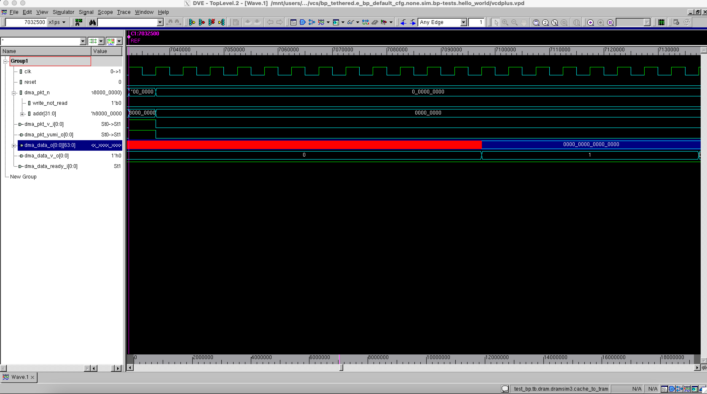

# Debugging Your BlackParrot Boot

## What do I do if Nothing Happens?

When integrating any IP into your project, the most common error is "nothing happens!". When dealing with a large, complex codebase, this is an intimidating blocker. This section details what to look for in your BlackParrot boot to smoke test the environment.

If you're working on FPGA, see below our FPGA System Bringup Best Practices below.

If you're working in RTL simulation, simply add these signals to the waveform environment. If they don't roughly match with this tutorial, double check that your environment emulates the testbench in bp\_top/test/tb/bp\_tethered/testbench.sv.

## FPGA System Bringup Best Practices

It is often very tempting to try to bring up your system on FPGA by trying to write Verilog and then directly run on FPGA, and then try to guess why it is not working. While it seems like this would be the least effort path to get things running, it will lead you down a path of countless wasted days. Here are best practices for FPGA bringup on a system where you have your own components that you are adding to BlackParrot:

- Debug the Software
    1. Start with the smallest subset of your software. Consider using Panic Room to start with instead of Linux, since it boots much faster in simulation. As you get things working, include more and more of the software.
    2. Make sure the software you are trying to get running works on Dromajo. This ensures that it is RISC-V compatible, and runs very quickly.
    3. Make sure the same software then runs on BlackParrot RTL, using co-simulation. Use cosimulation to localize any points of divergence.   
    4. Make sure that the same software runs on BlackParrot, after using the FPGA synthesis tool, i.e. post-synth simulation.

- Debugging the FPGA Hardware
    - Decompose your FPGA-based system into subset systems, so you can divide-and-conquer debug and do unit tests on each piece of I/O. Do not try to build a system that has PCI-E, Ethernet, DRAM, etc, and expect it all to work. Start with design that has BlackParrot using SRAM and turning on a LED. Then have BlackParrot use a DRAM. Then have BlackParrot do just PCI-E. Then DRAM and PCI-E etc. Save the infrastructure for each of these builds so that when you have a problem, you can quickly isolate the problem by running a regression.
    - For each of these subset systems
        1. Build a testbench, which include models of the I/O devices in questions. Not all I/O devices have models, but many of them do. This feels tedious, but we have found that once you have this, convergence is very fast, and without it, you can spend literally months.
        2. Simulate in RTL. Use bind statements or waveform viewer to monitor the key signals that show what BlackParrot is doing, and see if it is hanging somewhere. Almost every packet that BlackParrot sends out has a response. Did the response come back?
        3. Carefully examine all synthesis warnings.
        4. Simulate post FPGA synthesis. This ensures that there is not a Vivado synthesis issue. We have found that Vivado frequently diverges from tools like Design Compiler.  
        5. Do place and route, and examine all timing warnings. Failure to meet timing on Xilinx-provided IP blocks is a major source of intermittant issues.
        6. Run on the FPGA.
        7. If does not work, use Chipscope to monitor the I/O signals going into and out of BlackParrot, and to monitor critical resources like the Program Counter.

- If you encounter an issue with FPGA and want feedback, we expect you to have performed these steps before contacting us, and to be able to produce the minimal intermediate subsystem, at the earliest step in the above sequence, that does not work; and to provide the relevant waveforms of signals inside BlackParrot, and a diagnosis of the observed problem with BlackParrot. This is exactly the same bar that we have internally on our team. If somebody on our team has a problem, this is what we would expect them to have done, and we would not look at the problem until they have completed these steps. Even when you provide this information, we will provide what advice we can, but our focus (and greatest level of expertise) is to chase down and kill bugs in the BlackParrot RTL; unfortunately, we do not have the resources to chase down bugs in other people's FPGA platforms.

## Boot Process (Method 1: NBF and Host Tether)

The first method of boot involves a host tether (i.e. a connection to a host machine) which sets up BlackParrot for execution. The BlackParrot NBF boot happens in several steps. An NBF (network boot format) loader in the testbench takes in an NBF file, and converts it into a series of I/O writes into the core. This I/O fills the DRAM, cce microcode, and sets configuration registers within BlackParrot. Usage of nbf.py is shown below:

    usage: nbf.py [-h] [--ncpus NCPUS] [--ucode ucode.mem] [--mem prog.mem]
              [--config] [--checkpoint sample.nbf] [--skip_zeros]
              [--addr_width ADDR_WIDTH]

The default NBF boot sequence is as follows (waveforms shown from executing the "hello world" program):
- reset is lowered. This must be lowered for 10 or more cycles. reset is raised.
- The freeze register is set. This prevents BlackParrot from fetching or executing instructions.
- I/O writes begin happening. There should be a single response for each request. These should look like the following:

- Configuration registers are set as seen below:

- The program is loaded into the L2 cache:

- The cache will fetch allocated lines from the DRAM. (In simulation this will be zero, but in hardware this may be an arbitrary uninitialized value):

- The freeze register is lowered. Instructions begin to be fetched:

- The register file should begin to see reads and writes:

## Boot Process (Method 2: Bootrom)

The second method of boot involves BlackParrot bootstrapping itself using an external bootrom. This configuration is demonstrated using a bootrom config such as e_bp_unicore_bootrom_cfg. Users can build a BlackParrot which uses this configuration by setting This version of BlackParrot will go through exactly the same steps as Method 1. However, the process is not driven through an NBF loader. Instead, BlackParrot will start fetching from the bootrom, which contains the configuration registers and cce microcode for a core. This self-bootstrapping bootrom can be found here: https://github.com/black-parrot-sdk/bootrom/blob/master/bootrom.S.

In the tethered testbench, this bootrom lives in the host https://github.com/black-parrot/black-parrot/blob/master/bp_top/test/common/bp_nonsynth_host.sv#L228. Any environment constructed using a bootrom configuration will need the bootrom mapped onto the I/O bus, beginning at the address found here: https://github.com/black-parrot/black-parrot/blob/master/bp_common/src/include/bp_common_addr_pkgdef.svh#L31.

