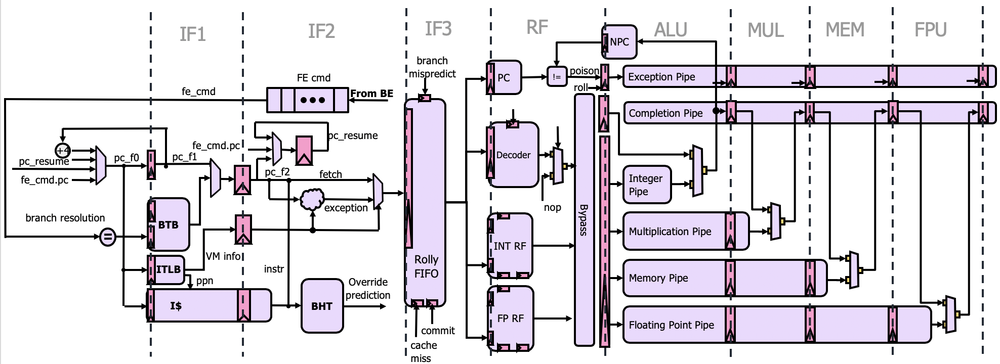

# BlackParrot Microarchitecture Guide
## Introduction
**Note: BlackParrot ultimately targets the RV64IMAFDC with M,S,U privilege modes and SV39 virtual memory. This guide attempts to describes the current state of the project.**

BlackParrot is a 64-bit processor implementing the RV64IMAFD specification of the RISC-V ISA. The core of the processor is in-order single issue, comprising a Front End (FE), a Back End (BE), and a Memory End (ME). The BlackParrot core supports virtual memory (SV39), and has private coherent L1 instruction and data caches. There are two major configurations for the BlackParrot Memory End. For single core systems, the Memory End is a lightweight state machine which manages requests between the L1 caches and either the LLC or DRAM. For multicore systems, the Memory End supports a novel, race-free MESI cache coherence protocol backed by a shared, distributed L2 cache. Both flavors of the Memory End support cache and uncached requests, along with simple request/response-based I/O.

This guide focuses on the core microarchitecture of a BlackParrot system. For information about the BlackParrot SoC architecture, refer to [SoC Guide](platform_guide.md).

## BlackParrot Core Overview
Communication between BlackParrot components is performed over a set of narrow interfaces. The interfaces are designed to allow the implementations of the Front End, Back End and Memory End to change independently of one another. For more information about these interfaces, refer to the [Interface Specification](interface_specification.md).

## Front End
The Front End (FE) is responsible for speculatively fetching instructions from the Memory End and providing the BE with stream of speculative PC-instruction pairs. To this end, FE consists of 2 major components: pc-generation and instruction memory. Note that the FE does not modify any architectural state and the BE logically controls the FE through PC redirect or flush commands.

### PC Generation
The PC generation module provides speculative PCs to the I$. It contains a BHT (Branch History Table), a BTB (Branch Target Buffer) and RAS (Return Address Stack). The BHT and BTB together provide a next line prediction. When the 2-cycle I$ returns, the instruction is partially decoded to determine whether it is a conditional branch, function call or function return. This information is used in conjunction with the BHT and RAS as a backing predictor, determining whether the currently predicted next line or to override with a calulated branch target.

### Instruction Memory Access
The instruction cache is a VIPT (Virtually-Indexed Physically-Tagged) cache with two pipeline stages: Tag Lookup (TL) and Tag Verify (TV). There are 3 hardened memories in the I$, the data mem, tag mem and stat mem. They are implemented as 1RW synchronous RAMs to be amenable to most commercial SRAM generators. In TL, the data memory and tag memory are accessed. In TV, the data from these caches is selected based on the result of the tag comparison. A small stat mem contains the LRU information for each set and is updated in TV as well. The I$ is non-stalling, requiring a replay on missed instructions.

The ITLB is a small, fully-associative buffer with a single-cycle access time. It is accessed in parallel with the data and tag memories of the I$. It is implemented with a synchronous, synthesized 1R1W CAM.

## Back End
The Back End (BE) is responsible for the non-speculative execution of RISC-V instructions. It receives a speculative instruction stream from the FE and processes them in order. The BE has one stall point in the ISD stage, and a single commit point at EX3. These simplifications erase the need for a PD-intensive global stall signal, as well as reduce the number of states to aid verification.

There are several components which are used to guarantee correct in-order execution:
- The Detector is used for hazard detection (structural, control and data), stalling the pipeline when a dependency cannot be met by forwarding.
- The Director holds a speculative Next PC (NPC), and communicats with the FE, correcting the fetch path upon branch mispredicts, traps or cache misses.
- The Scheduler is responsible for dispatching the next instruction or exception from the FE, reading the register file and doing a light pre-decode to help with hazard detection.

The Calculator is composed of a non-stalling set of pipelines which can each handle a subset of
RISC-V instructions:
- Integer Pipeline, executes 1-cycle integer instructions
- Control Pipeline, executes 1-cycle control flow instructions, including early-writeback of
  the speculative NPC to the Director
  - The Control Pipeline is capable of generating instruction misaligned exceptions
- Memory Pipeline, executes 2/3-cycle D$ access instructions
  - The Memory Pipeline is capable of generating memory access and page fault exceptions
  - The Memory Pipeline also contains a hardware page table walker, used for both I$ and D$
  - Integer loads and all stores take 2 cycles, float loads take 3 cycles
- Floating-point Auxiliary Pipeline, executes 2-cycle floating point conversion operations
  - FMV, FCVT, FSGNJ, FMIN/FMAX, FCMP
  - Floating point values are stored in the register file in a 65-bit recoded double-precision format, along with a
    1-bit tag that identifies whether the value was originally a single or double precision value. The AUX pipe, along with the float operations in the data cache, are responsible for making this abstraction invisible to the user (operations which transfer into or out of the registers result in IEEE-compliant float values).
- System Pipeline, executes 3-cycle CSR access instructions, and also handles exceptions and
  interrupts
  - The System Pipeline is responsible for actually modifying architectural state (CSRs,
    Architectural PC)
  - The System Pipeline is also capable of accepting asynchronous events, such as page table walker
    faults and interrupts
- Fused Multiply-Add Pipeline, executes 4-5 cycle FMA instructions
  - 5 cycle FMA unit handles all arithmetic FP operations
  - We reuse the floating point multiplier for a 4-cycle integer multiply
- Long Pipeline, executes iterative division and square root
  - This operation blocks the pipeline

### Data Cache
The data cache is a VIPT (Virtually-Indexed Physical-Tagged) cache with three pipeline stages: Tag Lookup (TL) and Tag Verify (TV). There are 3 hardened memories in the D$: the data mem, tag mem and stat mem. They are implemented as 1RW synchronous RAMs to be amenable to most commercial SRAM generators. In TL, the data memory and tag memory are accessed. In TV, the data from these caches is selected based on the result of the tag comparison. Additionally, data is written to a 2-entry writebuffer, which is used to prevent data memory structural hazards. Data mux (DM) stage sign extends, recodes floating point loads and selects subword loads.

## Memory End
Refer to the [BedRock Microarchitecture Guide](bedrock_uarch_guide.md) for an overview of the cache
coherence directory designs employed in BlackParrot.

