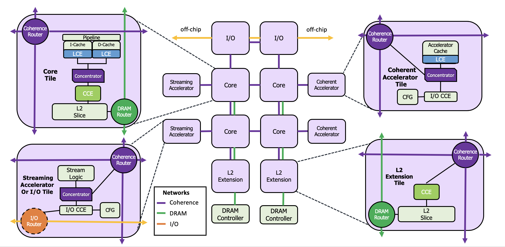

# BlackParrot Platform Guide
## Tile Taxonomy

## Instruction Latencies
* RV64I arithmetic instructions have 1-cycle latency
* RV64IA memory instructions have 3-cycle latency
* RV64M instructions have a 4-cycle latency, except for division, which is iterative
* Rv64FD instructions have a 5-cycle latency, exception for fdiv/fsqrt, which are iterative
* BlackParrot has a load-to-use time of 2 cycles for dwords, 3 cycles for words, halfs, and bytes
* BlackParrot has a 2-cycle L1 hit latency
* BlackParrot has a 2-cycle L2 hit latency, plus possible network interaction

BlackParrot has full forwarding for integer instructions

## CSRs
BlackParrot supports the following CSRs:
* U-mode
  * ustatus, cycle, time. instret
* S-mode
  * sstatus, sscratch, sepc, scause, stval, sip, satp
* M-mode
  * mvendorid (0), marchid (13), mimpid (1, incremented on tapeout), mhartid, mstatus
  * misa ({2'b10, 36'b0, 26'h140101}), medeleg, mideleg, mie, mtvec, mtvec, mcounteren
  * mscratch, mepc, mcause, mtval, mip, mcycle, minstret, mcountinhibit
* D-mode (Full debug mode support is a work-in-progress)
  * dcsr
  * dpc

## Memory-mapped Devices
BlackParrot supports having a number of devices in each tile. In a standard BlackParrot tile there is:
* CLINT (Core Local Interrupt Controller)
  * Contains memory-mapped registers used to control interrupts in a tile
  * mtime: 0x30_bff8
  * mtimecmp: 0x30_4000
  * mipi: 0x30_0000
  * mtime increments at a frequency much lower than the clock speed
  * When mtimecmp >= mtime, a timer irq is raised
  * When mipi is set, a software irq is raised
TODO: update config map
* CFG (Tile Configuration Controller)
  * Contains memory-mapped registers which provide system-level configuration options and debug access
  * Freeze - prevents the processor from executing instructions
  * Core id (read-only) - identifies the core among all cores
  * Domain id (read-only) - 3 bits identifying the ASIC group this core belongs to
  * Coordinate (read-only) - identifies the tile physical location on the NoC
  * Icache id (read-only) - the LCE id of the icache
  * Icache mode - Uncached only, or fully coherent
  * NPC - sets the PC of the next instruction to be executed
  * Dcache id (read-only) - the LCE id of the dcache
  * Dcache mode - Uncached only, or fully coherent
  * Privilege mode - the current privilege mode of the core
  * Integer registers - read / write access to the integer registers
  * CCE id (read-only) - the CCE id of the tile
  * CCE mode - Uncached only, or fully coherent
  * CSRs - read / write access to the CSR regfile
  * CCE ucode - read / write access to the CCE microcode

## Fencing
There are two types of fence instructions defined by RISC-V: FENCE.I (instruction fence) and FENCE
(data fence). BlackParrot NoCs use credit-based flow control, so fences simply wait in the dispatch
stage until all credits have been returned and no memory instructions are in the pipeline. Because
instruction and data caches are fully coherent, FENCE.I is implemented as a normal fence and a full
pipeline flush, restarting instruction fetch at the instruction after the FENCE.I.

For the unicore version of BlackParrot, the caches are not coherent. Therefore, on FENCE.I, the
D$ goes through a flush routine, then the I$ goes through an invalidate routine.

## Emulated Instructions
BlackParrot implements the A extension partially in hardware and partially via emulation.
Specifically, LR (Load Reserved) and SC (Store Conditional) are implemented in hardware. For
instance, this is the emulation routine for amo_swap.w

    # AMO_SWAP.W
    # Parameters
    #  a0: 32-bit aligned address
    #  a1: data to store in [a0]
    # Return
    #  Data originally in [a0]
    amo_swapw:
     lr.w t0, (a0)
     sc.w t1, a1, (a0)
     bnez t1, amo_swapw
     mv a0, t0
     jalr x0, ra

A typical execution for an atomic instruction is therefore:
* fetch amo_add
* illegal instruction trap to M-mode
* fetch instruction decode routine
* software decode instruction
* execute emulation routine
* return from M-mode emulation

Similarly, BlackParrot emulates MULH, MULHSU, MULHU using hardware supported MUL instructions.

## Platform Address Maps
### Global Address Memory Map
* 0x00_0000_0000 - 0x00_7FFF_FFFF
  * Uncached, local memory
  * (See local address map for further breakdown)
* 0x00_8000_0000 - 0x0F_FFFF_FFFF
  * Cached, global memory
  * Striped by cache line
  * DRAM region
* 0x10_0000_0000 - 0x1F_FFFF_FFFF
  * Uncached, global memory
  * Striped by tile
  * Streaming accelerator region
* 0x20_0000_0000 - 0xFF_FFFF_FFFF
  * Uncached, ASIC-global memory
  * Striped by tile
  * Off-chip region

### Local Address Map
* 0x00_0000_0000 - 0x00_0(nnnN)(D)(A_AAAA)
  * nnnN -> 7 bits = 128 max tiles
  * D -> 4 bits = 16 max devices
  * A_AAAA -> 20 bits = 1 MB address space per device
* Examples
  * Devices: Configuration Link, CLINT, scratchpad
  * 0x00_0101_2345 -> tile 1, device 1, address 2345 -> configuration register
  * 0x00_0200_1111 -> tile 0, device 0, address 1111 -> CLINT mtimecmp
  * 0x00_0402_0000 -> tile 2, device 2, address 0000 -> accelerator scratchpad

