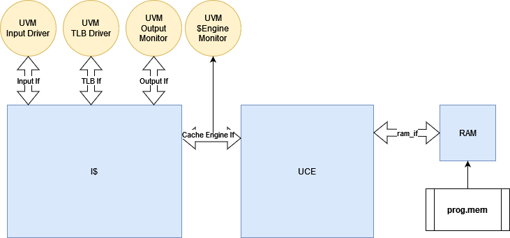

# UVM GUIDE For Black Parrot
## Current Extent of UVM Support
  Currently UVM is only supported for the BP L1 I-cache found in /bp_fe/src/v/bp_fe_icache.sv with a UCE connected.

## How to Simulate Existing Testbenches:
* Navigate to /bp_fe/syn/
* Base command: make run_testlist.v UCE_P=1 UVM=1
  * Note: At this time the UVM testbench only supports VCS.
* Options:
  * UVM_VERBOSITY = UVM_NONE - UVM_FULL
    * Sets the verbosity of UVM messages for the simulation using the plusarg of the same name.
  * DEBUG = 1
    * Launches DVE/Verdi in interactive mode depending on whether the $VERDI_HOME environment variable has been set.

## Explanation of Testbench Design:

### UVM Background:
If you are new to the Universal Verification Methodology(UVM), then you should first spend some time learning the general concepts.  A few recommended resources are listed below:
https://verificationacademy.com/cookbook/uvm
https://verificationacademy.com/courses/uvm-basics
https://verificationacademy.com/courses/advanced-uvm
https://ieeexplore-ieee-org.ezproxy.bu.edu/document/9195920

### I-Cache Testbench Overview:

The top level module [testbench.sv](../bp_fe/test/tb/uvm/testbench.sv) contains an instance of the I$, the UCE, and non-synthesizable DRAM.
There are four interfaces, the data input, the data output, the TLB, and the Cace Engine (UCE).  These are all defined in [icache_uvm_if.sv](../bp_fe/test/tb/uvm/icache_uvm_if.sv).  The reason that four separate interfaces are used is to be able to drive and monitor each interface independent from the other (as will be discussed further when talking about virtual sequences below).

### I-Cache Testbench Components
#### Enviornment
Located at [icache_uvm_cfg.sv](../bp_fe/test/tb/uvm/icache_uvm_cfg.sv), the configuration information for the enviorment (and agents) are passed using configuration objects.  For the enviornment, the configuration objet (which is set by each test) passes handles to each of the four interfaces and a bool for each interface to indicate whether that interface's agent is active or passive.  This information is then passed to each agent (there is one for each interface) by creating agent configuration objects and setting the activity of the agent. In the context of UVM, an active agent is one who has a sequencer and a driver, where a passive agent does not (there will be a monitor regardless).  

#### Agents
The agent contains the monitor and depending on the activity level also the sequencer and driver, which for the sake of discussing connections we will assume are instantiated.  Within the agent, the sequencer is connected to the driver and sends transactions for the driver to drive depending on the sequence defined in the test.  The monitor is also connected to the analysis port that each agent posses, which broadcasts to the subscribers.

#### Monitors
The monitor is intended at every clock edge to make a transaction from the values of the wires on the interface at that given point in time and send them to the subscribers.
* There is one monitor per interface in the design.
* The run phase consists of the following steps:
  * Waits for reset to go low intially
  * At each positive clock edge:
  1. Depending on the interface, check if valid bit is set
  2. Package interface pins as a transaction.
  3. Send transaction over analysis port to subscribers (described below).

#### Drivers

### I-Cache Analysis Components
#### Coverage Collector
#### Scoreboard

### I-Cache Tests and Sequences
#### Current Tests
