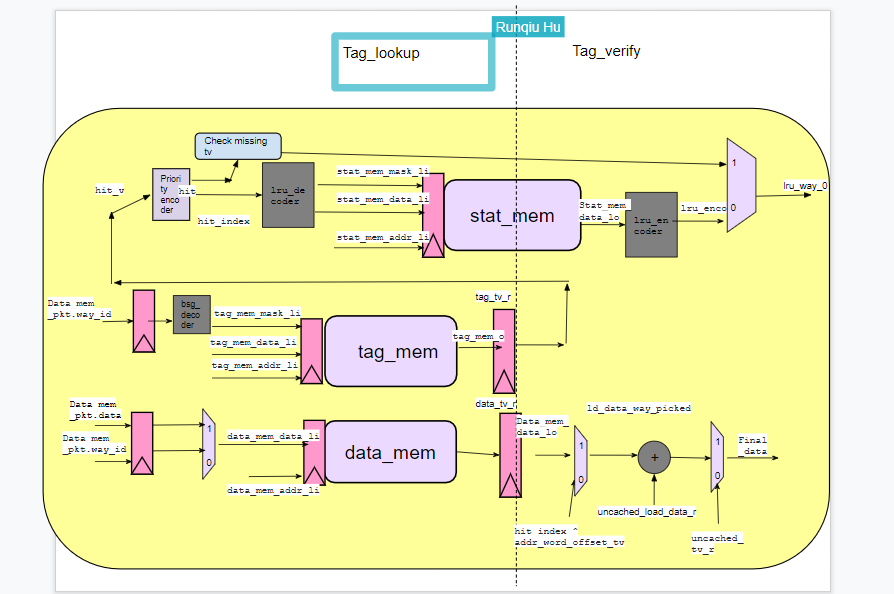
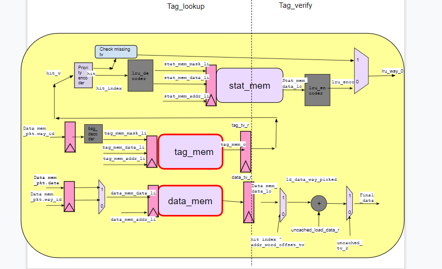

# Black Parrot Project

We will going to do the part d, which is making icache suitable for 32 KB 8 associativity to 16-4,8-2,4-1

## Group Member

Runqiu Hu, Feng Xiong

### Pointer to original schematic

### Pointer to modified schematic

## Pointer to your Notebook file

None

